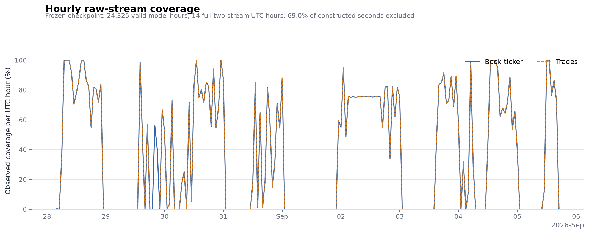
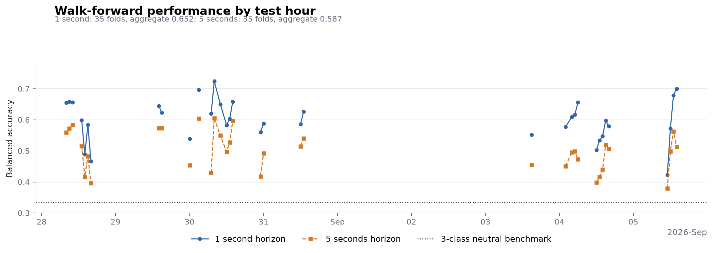
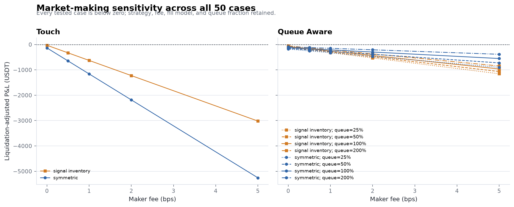

# Final Research Report

## Answer-first conclusion

The engineering and research pipeline passed its final reproducibility validation, but the tested
market-making mechanism did not pass its economic falsification tests. The final checkpoint
contains 24.325 valid hours and 75,000+ out-of-sample observations per horizon. Order-flow features
show directional information under the balanced Logistic evaluation, but every one of the 50
fee/fill/queue scenarios has negative liquidation-adjusted P&L and negative aggregate one-second
markout.

**Decision: stop the current quoting specification.** Preserve it as a well-controlled negative
result and portfolio project. Do not tune additional parameters against this sample. Any future
extension should be a separately specified experiment using cleaner continuous capture and
price-level depth/queue reconstruction.

## Scope and frozen evidence



| Item | Final value |
|---|---:|
| Checkpoint | `20260905T1712Z-final` |
| Instrument | BTCUSDT spot |
| Raw book-ticker updates | 13,582,663 |
| Raw trades | 4,891,134 |
| Processed one-second rows | 282,197 |
| Valid one-second rows | 87,570 |
| Valid coverage | 24.325 hours |
| Full UTC hours with both streams | 14 |
| Valid contiguous segments | 381 |
| Longest valid segment | 3,591 seconds |
| Duplicate second keys | 0 |
| Final independent validation | 29 / 29 checks passed |

The wall-clock span is 2026-08-28 04:14:08 through 2026-09-05 16:54:22 UTC. It is not a
continuous 24-hour recording. Host suspension and network loss created a maximum receive-time gap
of roughly 22.4 hours. The pipeline retains those gaps rather than manufacturing zero-flow data.

## Data engineering and quality

The collector uses a bounded asynchronous queue, reconnect backoff, application-message idle
detection, atomic immutable Parquet parts, UTC partitioning, and run manifests. It subscribes only
to Binance's public market-data endpoint; the code has no live-order path.

Raw structural QA found zero duplicate event IDs, nonpositive prices or quantities, crossed quotes,
or locked quotes in both streams. At the bar layer, 194,627 rows (68.97%) are marked invalid, stale,
or post-gap warm-up observations. They remain available for audit but are excluded from modeling
and replay, leaving exactly 87,570 valid seconds.

The final checkpoint's live-freshness flag is false because collection was intentionally stopped
before independent validation. This is recorded as a validation warning, not hidden. The underlying
stream-level structural checks pass.

## Causal features and labels

The model allowlist contains spread, book imbalance, microprice deviation, one- and five-second
trade imbalance, five-second trade intensity, lagged mid return, and ten-second realized
volatility. Features are computed from information available by the decision timestamp. Every
`future_` column is excluded from the allowlist, and labels are invalidated whenever their horizon
crosses an ineligible second or data gap.

Chronological train/validation/test splits use horizon-sized embargoes. Expanding-history
walk-forward folds train only on observations earlier than the scored UTC hour; disconnected
segments can contribute independent rows but are never treated as adjacent seconds.

## Prediction results



The single-segment baselines use the longest 3,591-second segment and serve only as a sanity check.

| Horizon | Test rows | Majority balanced accuracy | Logistic balanced accuracy | Logistic macro F1 |
|---|---:|---:|---:|---:|
| 1 second | 718 | 0.3333 | 0.5585 | 0.3842 |
| 5 seconds | 718 | 0.3333 | 0.4558 | 0.3836 |

The broader walk-forward evaluation is the primary predictive evidence.

| Horizon | Folds | OOS rows | Logistic balanced accuracy | Macro F1 | ECE |
|---|---:|---:|---:|---:|---:|
| 1 second | 35 | 75,964 | 0.6518 | 0.5201 | 0.0973 |
| 5 seconds | 35 | 75,441 | 0.5870 | 0.5821 | 0.0852 |

Across folds, balanced accuracy ranges from 0.4234 to 0.7245 at one second and from 0.3794 to
0.6053 at five seconds. The latest scored fold has materially worse calibration (ECE 0.2517 and
0.2657) than the aggregate. Four five-second coefficient terms fail the 75% sign-consistency
threshold. The model therefore demonstrates measurable directional structure, not a stable or
tradable alpha claim.

## Market-making replay

All rows below use a 1 bp maker fee. `touch` is deliberately optimistic. `queue_aware` additionally
requires opposing flow to clear an assumed fraction of displayed top-of-book quantity, but still
does not reconstruct exact queue priority, cancellations, or latency.

| Strategy | Fill model | Fills | 1s markout | Fees | Liquidation-adjusted P&L |
|---|---|---:|---:|---:|---:|
| Symmetric | Touch | 127,948 | -74.56 | 1,011.73 | -1,159.79 |
| Symmetric | Queue-aware | 9,782 | -72.58 | 76.80 | -210.80 |
| Signal + inventory | Touch | 74,476 | -71.73 | 588.90 | -627.49 |
| Signal + inventory | Queue-aware | 23,964 | -61.82 | 171.04 | -256.73 |

Maximum absolute inventory reaches the configured 0.01 BTC limit in every scenario. Drawdowns are
approximately as large as final losses, and adverse selection dominates spread capture.

## Sensitivity and falsification



The frozen grid evaluates two strategies, touch and queue-aware fills, maker fees of 0, 0.5, 1,
2, and 5 bp, and queue-ahead fractions from 0.25x to 2x where applicable.

- Positive cases of any kind: **0 / 50**.
- Positive cases with nonzero fees: **0**.
- Positive queue-aware cases: **0**.
- Positive cases with both nonzero fees and queue-aware fills: **0**.
- Best case: signal/inventory with touch fills and zero fees, P&L **-29.76**.

This rejects the current economic hypothesis more strongly than an ordinary best-parameter
backtest: even the optimistic zero-fee case is negative.

## Limitations

- Top-of-book data cannot reconstruct price-level queue position or cancellations.
- No explicit latency, order replacement, exchange rejection, or partial-fill mechanics are
  modeled.
- Coverage is fragmented across several days and regimes; only 14 hours have full two-stream UTC
  coverage.
- The longest continuous eligible block is under one hour, so the single-segment baseline is weak
  evidence by design.
- Walk-forward predictive metrics are class-balanced research diagnostics and must not be mapped
  directly to P&L.
- Repeated exploration creates multiple-testing risk; the negative result should not be rescued by
  unconstrained tuning.

## Reproducibility and validation

The frozen source artifacts live under
`reports/generated/checkpoints/20260905T1712Z-final/`. Reproduce the independent review with:

```bash
uv sync --extra dev
uv run orderflow-mm validate-checkpoint \
  --checkpoint reports/generated/checkpoints/20260905T1712Z-final/checkpoint.json \
  --report reports/generated/checkpoints/20260905T1712Z-final/final-validation.json
uv run ruff format --check src tests
uv run ruff check src tests
uv run pytest
```

The final validator passes 29 of 29 checks. It verifies the coverage arithmetic, raw structural
quality, causal feature allowlists, chronological embargoes, walk-forward row reconciliation,
artifact existence, the complete four-scenario matrix, the 50-case sensitivity grid, and the
profitability-claim guardrail.
